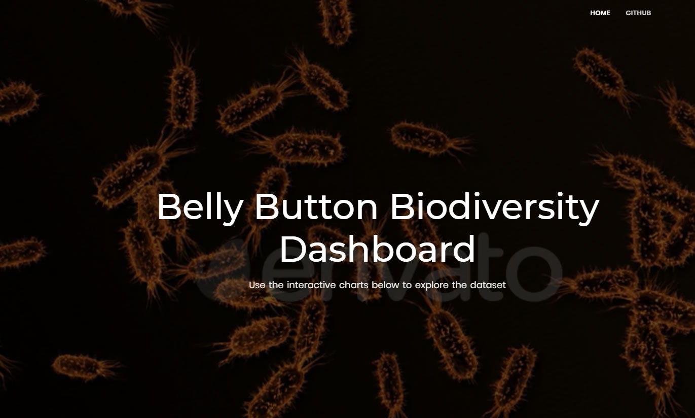
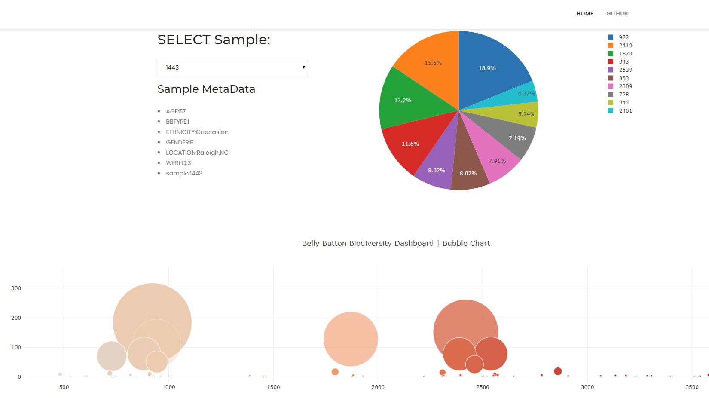

# Plot.ly Homework - Belly Button Biodiversity

## Issues

I feel upon some issues running the application in Heroku. I documented the trail log files in the git hub.
Above are the screenshots when I was launching the app.py using my local flask web server.
